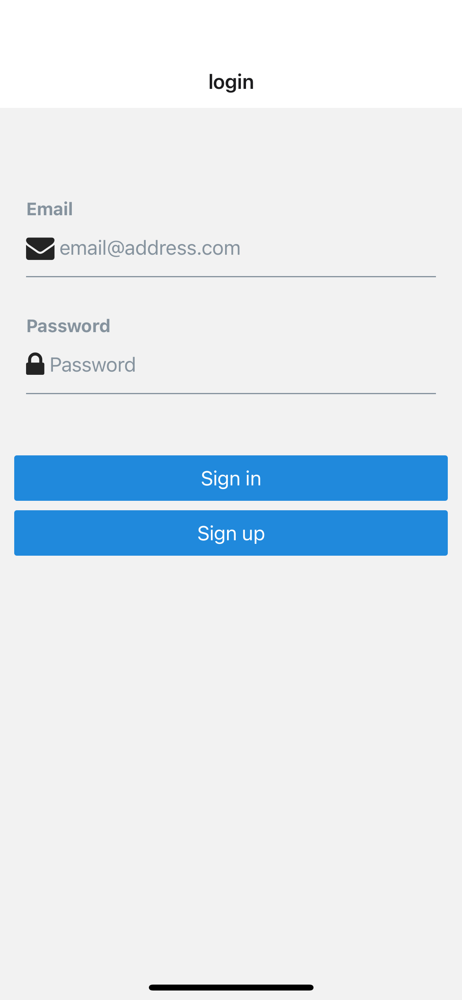
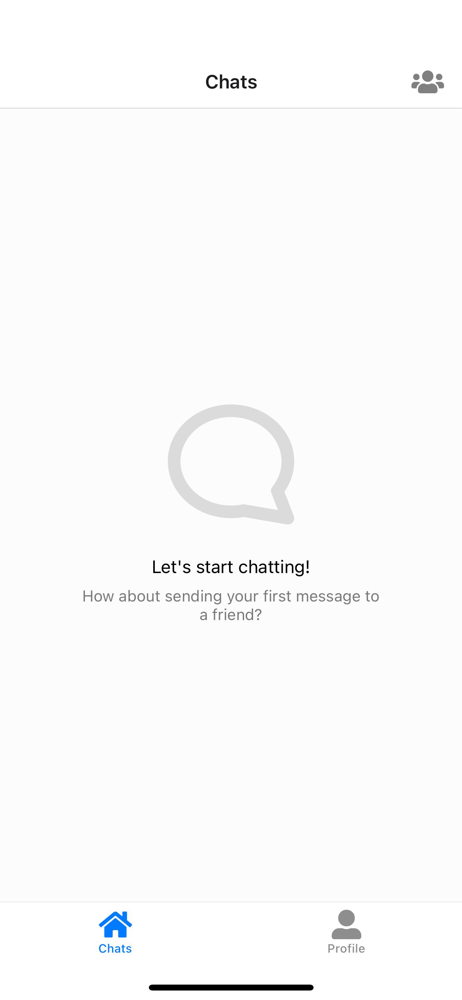
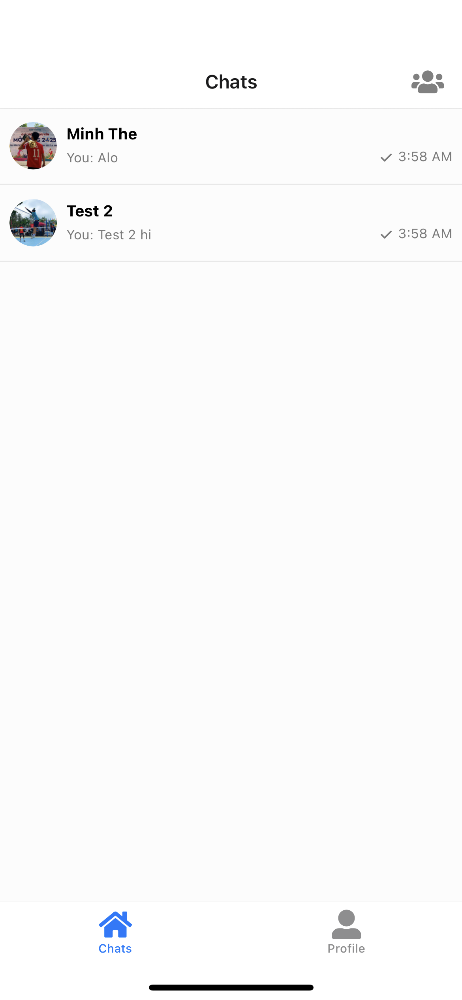
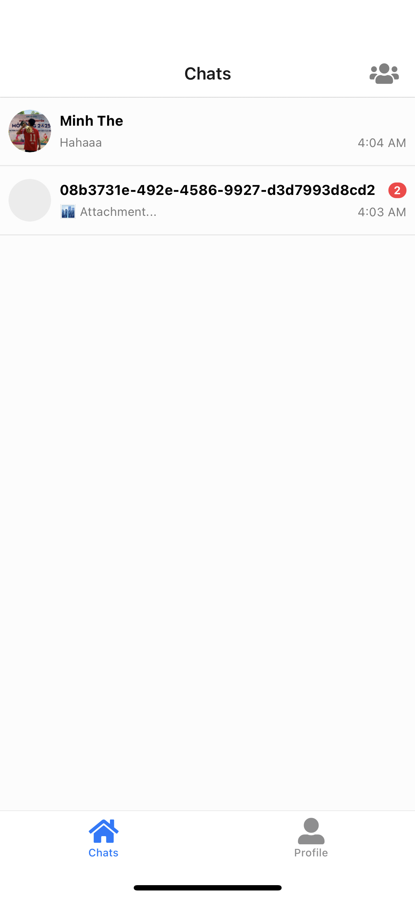
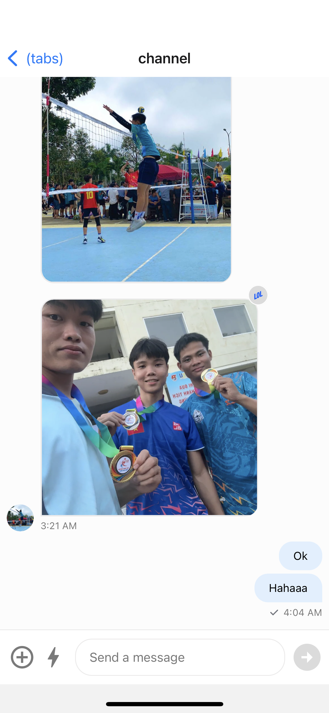
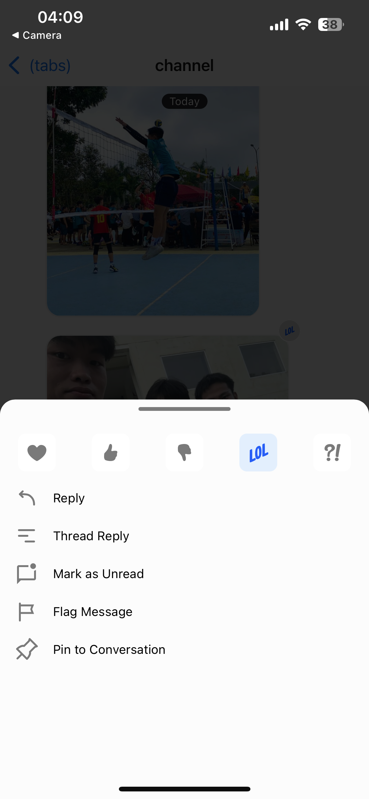
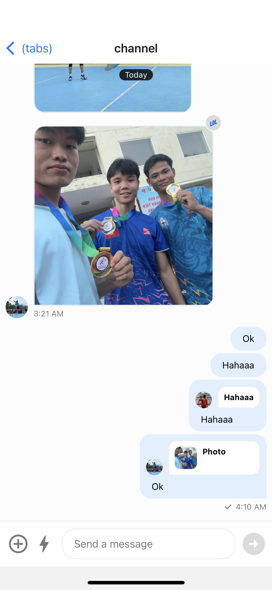
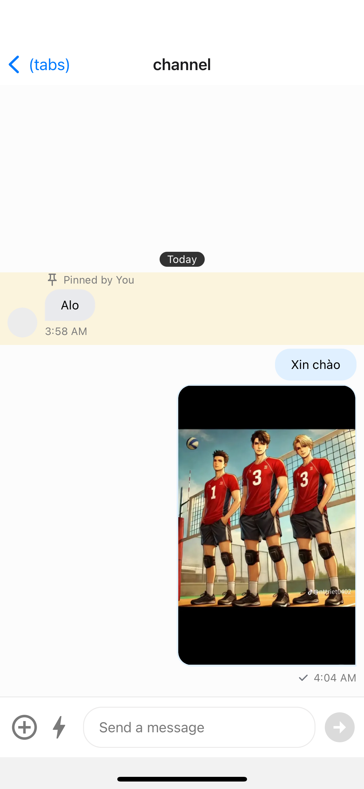
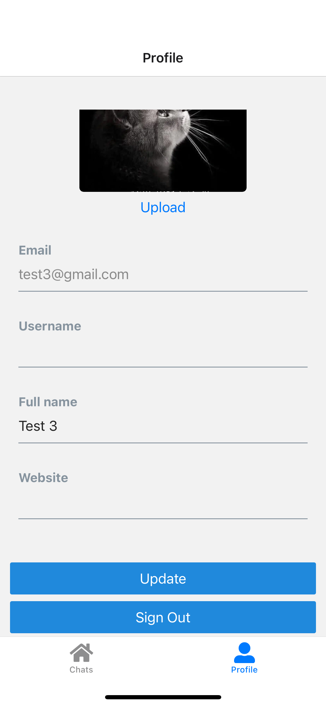

# Telegram Clone 📱

A full-featured Telegram Clone built with Expo, Supabase, and Stream Chat. This application replicates the essential functionalities of the popular messaging platform, including text messaging, profile editing, media sharing, reactions, replies, and message pinning.

## 🚀 Features

- **Real-time Messaging**: Send and receive messages in real-time using Stream Chat.
- **Profile Editing**: Users can edit their profile including name, picture, and bio.
- **Send Images & Files**: Upload and share images, videos, and other files within chat.
- **Message Reactions**: React to messages with emojis.
- **Reply to Messages**: Reply to specific messages within the chat.
- **Pin Messages**: Pin important messages to the top of the chat.
- **Authentication**: Sign in and sign up using Supabase.

## 🛠️ Technologies

This project is built using the following technologies:

- **Expo**: A framework and platform for universal React applications. Used for building the front-end of the app.
- **Supabase**: An open-source Firebase alternative for real-time databases and authentication. Used for managing user data and chat history.
- **Stream Chat**: A powerful messaging API that allows you to build rich, scalable chat applications. Used for handling real-time messaging, reactions, and media sharing.

## ⚙️ Getting Started

### Prerequisites

- Node.js (version 16 or later)
- React Native (Expo CLI)
- Supabase account
- Stream Chat account

### Installation

1. **Clone the repository:**

```bash
git clone https://github.com/leeminhhthee/telegram_clone.git
cd telegram_clone
```

2. **Install dependencies:**

```bash
yarn install
```

3. **Set up environment variables:**

Create a `.env` file in the root directory and add the following keys:

```bash
EXPO_PUBLIC_STREAM_API_KEY=your_supabase_api_key
EXPO_PUBLIC_SUPABASE_URL=your_supabase_url
EXPO_PUBLIC_SUPABASE_ANON_KEY=your_supabase_anon_key
```

Replace `your_supabase_api_key`, `your_supabase_url`, and `your_supabase_anon_key` with your actual credentials from Supabase and Stream Chat.

4. **Start the app:**

```bash
yarn start
```

This will launch the app on a local Expo server. You can open the app on your mobile device using the Expo Go app or an emulator.

## Usage

Once the app is running, users can:

- Create an account or log in via Supabase authentication.
- Send and receive messages in real-time.
- Upload and share images and files.
- Edit their profile with a profile picture, name, and bio.
- React to messages using emojis.
- Reply to specific messages within the chat.
- Pin important messages.

## 🌍 Demo

Here’s a brief demo of the Telegram Clone app in action:

- **Sign In Screen:** Users can sign in or create a new account.
- **Main Chat Screen:** View and send messages, upload media, and react.
- **Profile Screen:** Edit user profile details.

## 🖼️ Screenshots

| Sign In Screen | Main Chat Screen | Main Chat Screen |
|----------------|------------------|------------|
|  |  |  |
| Main Chat Screen | List Users Screen| Send Image|
|  |  |  |
| Reaction | Reply to Message | Pinned Message
|  |  |  |
| Profile Edit | 
|  | 


## 🤝 Contributing

Contributions are welcome! If you have suggestions or improvements, feel free to open an issue or submit a pull request.
